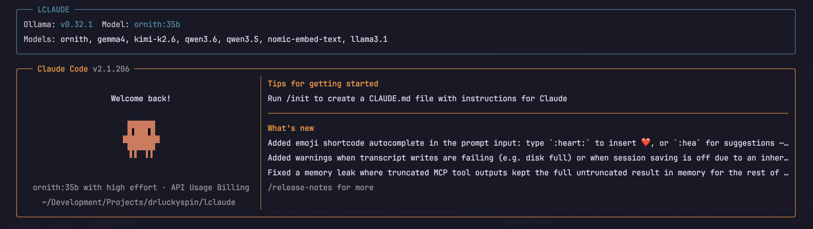
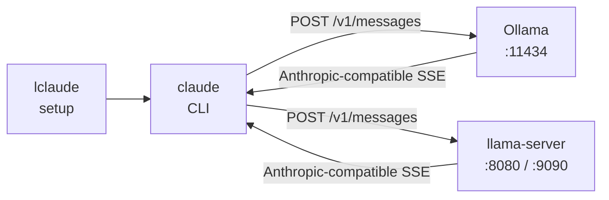
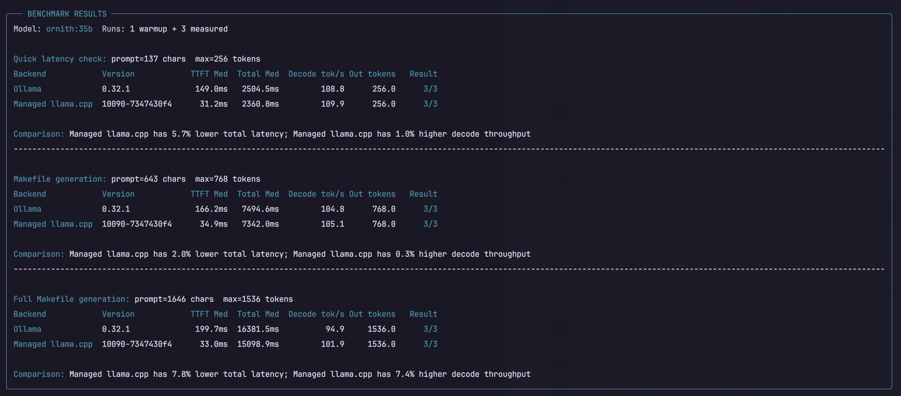

# LCLAUDE



Run [Claude Code](https://docs.anthropic.com/en/docs/claude-code) against a **local** LLM instead of the Anthropic cloud
API.

`lclaude` (local claude) is a single-file Python wrapper (**stdlib only**, **Python 3.11+**) that points the `claude`
CLI at Ollama, llama.cpp, or both. No proxy process, no extra dependencies.

## What is `claude`?

`claude` is Anthropic’s agentic coding CLI. It reads your repo, runs tools (edit files, shell, search), and talks to a
model over the **Anthropic Messages API** (`POST /v1/messages`). Out of the box it expects Anthropic’s cloud. Both
[Ollama](https://ollama.com/) and [llama.cpp](https://github.com/ggml-org/llama.cpp)’s `llama-server` can speak that
same API on localhost — so `claude` can drive a local model if you redirect `ANTHROPIC_BASE_URL` and auth.

## Why this project?

`claude` only talks to Anthropic's cloud by default. Ollama and llama.cpp already expose the same Messages API locally,
but you still need to set env vars, validate models, work around chat-template incompatibilities (Ornith / Qwen 3.x),
and restore `~/.claude/settings.json` afterwards. `lclaude` handles that: it detects available backends, patches
settings for the session, spawns `claude`, and restores everything on exit. Your last model and backend are saved to
`~/.config/lclaude/config.toml` so subsequent runs reuse them.

## Quick start

Requires Python 3.11+; the commands below install `claude` and Ollama with Homebrew.

```bash
brew install ollama claude-code
# optional, for Managed llama.cpp Ornith/Qwen template fixes:
# brew install llama.cpp

ollama pull ornith:35b
cp lclaude.py ~/bin/lclaude && chmod +x ~/bin/lclaude

lclaude
# or:
lclaude --model ornith:35b
```

After a successful start, prefs are saved to `~/.config/lclaude/config.toml` so the next bare `lclaude` reuses
your last model and backend.

> [!NOTE]
> Ornith’s embedded Qwen 3.6 template rejects system messages after the first turn — that breaks `claude` tool use with
> a stock `llama-server --jinja`. **auto** / **managed** patch this automatically when llama.cpp is installed. For a
> manual `llama-server`, always pass `--chat-template-file` (see below).

## How it works



With `--backend auto` (default), `lclaude` chooses in this order:

1. A healthy (or still-loading) user-managed `llama-server` on the llama.cpp port (default **8080**)
2. Else, for models that need a Claude template patch (Ornith / Qwen 3.x), if `llama-server` is on `PATH` and Ollama has
   the model → **Managed llama.cpp** mode (spawn llama-server from the Ollama blob on **9090**, patched template)
3. Else Ollama (auto-start `ollama serve` if needed)
4. Else a short error with next steps

Then it points `claude` at localhost and removes conflicting cloud/proxy routing settings (including
[Portkey](https://portkey.ai/) credentials and custom Anthropic headers) from the temporary Claude settings and child
environment. On exit it restores `~/.claude/settings.json` and stops any llama-server it started.

No proxy — traffic goes straight from `claude` to the local Anthropic-compatible endpoint.

## Config (last used)

Path: `~/.config/lclaude/config.toml`

Created/updated after a successful backend start. Example:

```toml
# lclaude last-used settings — edit freely or override with CLI / env.
# Precedence: CLI flags > LCLAUDE_* env > this file > built-in defaults.

model = "ornith:35b"
backend = "auto"
# port = 8080   # only written when you overrode the port
```

**Precedence:** CLI flags → `LCLAUDE_MODEL` / `LCLAUDE_BACKEND` / `LCLAUDE_PORT` → config → built-in defaults.

When you run with `backend = "auto"`, that preference is what gets saved (not the resolved engine). Edit the file or override for one run:

```bash
lclaude --backend ollama
LCLAUDE_MODEL=ornith:35b lclaude
```

## Usage

```bash
lclaude                                    # auto + last-used / default model
lclaude --help
lclaude --version                          # local backend status; does not start Claude or a managed server
lclaude --list                             # list Ollama models
lclaude --model ornith:35b
lclaude --backend ollama
lclaude --backend managed --model ornith:35b
lclaude --backend llamacpp --port 8080
lclaude -p "explain this file"             # args after lclaude flags go to claude
```

### Options

| Option         | Description                                                                       | Default             |
| -------------- | --------------------------------------------------------------------------------- | ------------------- |
| `--backend`    | `auto`, `ollama`, `llamacpp`, or `managed`                                        | `auto`              |
| `--port`       | Override listen port                                                              | 11434 / 8080 / 9090 |
| `--model`      | Model name (must exist in Ollama for `ollama`/`managed`; cosmetic for `llamacpp`) | `ornith:35b`        |
| `--list`       | List Ollama models (`ollama` / `managed` / `auto`)                                | —                   |
| `--version`    | Show local backend status without launching Claude Code or a managed server       | —                   |
| `-h`, `--help` | Show help                                                                         | —                   |

## Backends: which should I use?

Most people should run `lclaude` with no `--backend` flag. The default, `auto`, looks for a compatible `llama-server`
you already have running, uses Managed llama.cpp when it can fix an Ornith or Qwen chat-template issue, and otherwise
uses Ollama.

- **Ollama (`--backend ollama`)**: the simplest option. `lclaude` sends requests to the Ollama app, and Ollama handles
  loading the model.
- **Managed llama.cpp (`--backend managed`)**: use this when you want llama.cpp’s runtime without manually starting it.
  `lclaude` takes the model you already pulled with Ollama, starts a temporary `llama-server`, and stops it when you
  leave `claude`.
- **Your llama.cpp server (`--backend llamacpp`)**: use this only if you already run `llama-server` yourself, perhaps
  with custom model files or flags. `lclaude` connects to it but never starts or stops it.

| Choice     | Best when                                      | What `lclaude` does                                   | Default port |
| ---------- | ---------------------------------------------- | ----------------------------------------------------- | ------------ |
| `auto`     | You want the recommended setup                 | Picks one of the options below                        | Varies       |
| `ollama`   | You want the least setup                       | Connects to Ollama, starting it if needed             | 11434        |
| `managed`  | You want a hands-off llama.cpp session         | Starts llama.cpp from an Ollama model, then cleans up | 9090         |
| `llamacpp` | You already manage a llama.cpp server yourself | Connects to that existing server                      | 8080         |

### What Managed llama.cpp does

Managed mode is not a different model format or a second copy of your model. It lets Ollama keep managing the model
download while `lclaude` runs that same model through `llama-server`. This is particularly useful for Ornith and Qwen
3.x models, whose built-in chat templates can reject valid `claude` tool conversations.

When you choose `managed`, `lclaude`:

1. Checks that Ollama is running and that the requested model is already installed.
2. Finds Ollama’s local model file.
3. Downloads a fixed chat template once for Ornith / Qwen 3.x models.
4. Starts `llama-server` on port 9090 and waits for it to load.
5. Launches `claude`, then stops only the server it started when you exit.

If the server cannot load the model, `lclaude` prints a short explanation and the path to
`~/.cache/lclaude/llama-server.log`.

### Cache layout

```text
~/.config/lclaude/config.toml     # last-used prefs
~/.cache/lclaude/
  qwen3.6-claude.jinja            # Claude-compatible chat template (optional download)
  llama-server.log                # managed llama-server log (current session)
```

### Compatibility

- Not every Ollama blob loads in every llama.cpp build. Example: some `qwen3.5` blobs fail with
  `qwen35.rope.dimension_sections` metadata mismatches. Fall back to `--backend ollama`, or use an upstream HuggingFace
  GGUF with `--backend llamacpp`.
- Do not `ollama rm <model>` while managed mode is using that blob.
- Port **9090** for managed avoids colliding with a user-managed server on **8080**.

## Manual llama.cpp setup

```bash
brew install llama.cpp
# or: build llama-server from https://github.com/ggml-org/llama.cpp

mkdir -p ~/.cache/lclaude
curl -L https://huggingface.co/spiritbuun/buun-Qwen3.6-chat_template/raw/main/chat_template.jinja \
  -o ~/.cache/lclaude/qwen3.6-claude.jinja

llama-server -hf deepreinforce-ai/Ornith-1.0-35B-GGUF \
  --chat-template-file ~/.cache/lclaude/qwen3.6-claude.jinja --port 8080
```

Then: `lclaude --backend llamacpp` (or bare `lclaude` if that server is healthy — auto prefers it).

Useful flags: `-ngl 99` (GPU), `-c 262144` (context), `-np 4` (parallel), `--api-key …`, `--port …`.

Reuse an Ollama blob without managed mode:

```bash
ollama show ornith:35b --modelfile | grep '^FROM'
llama-server -m /path/from/FROM --chat-template-file ~/.cache/lclaude/qwen3.6-claude.jinja --port 8080
```

Notes for `--backend llamacpp`:

- `--model` is display-only (server already has one model loaded)
- No auto-start; no `--list`
- If the live template rejects late system messages, `lclaude` refuses to start and tells you how to fix it (or use
  managed / auto)

## Benchmark Ollama and llama.cpp



`lclaude-bench.py` is a VERY basic utility that compares the raw streaming `POST /v1/messages` inference path used by
`lclaude`. It does not launch `claude`, patch `~/.claude/settings.json`, or write `~/.config/lclaude/config.toml`.

```bash
python3 lclaude-bench.py
python3 lclaude-bench.py --quick
python3 lclaude-bench.py --model ornith:35b --warmup 1 --repeats 5
python3 lclaude-bench.py --backends ollama,managed --unload-between --cooldown 10
python3 lclaude-bench.py --backends llamacpp --llamacpp-port 8080
python3 lclaude-bench.py --dry-run
python3 lclaude-bench.py --json > benchmark.json
python3 lclaude-bench.py --verbose
python3 lclaude-bench.py --quiet --json > benchmark.json
```

Useful controls:

- `--backends ollama,managed,llamacpp` selects targets; `--port` overrides every selected target, while `--ollama-port`,
  `--managed-port`, and `--llamacpp-port` override them individually.
- `--timeout SECONDS` sets the per-request socket timeout (default: 600).
- `--keep-managed` leaves the benchmark-owned Managed llama.cpp server running after its suite; `--no-color` disables
  ANSI styling.
- `--quiet` suppresses the benchmark header and all progress; `-v` / `--verbose` expands progress to setup, warmup, and
  individual requests.

It reads the same model, backend, and port preferences with the same precedence as `lclaude`: CLI → `LCLAUDE_*` env →
config → defaults. An `auto` preference (the normal default) compares Ollama and Managed llama.cpp sequentially. A
pinned backend runs only that target unless `--backends` overrides it. `llamacpp` is also available as a target when you
have a user-managed llama-server.

By default, each backend runs a reproducible staged workload: a short latency request, then two increasingly detailed
requests to generate a Makefile for `lclaude.py` and `lclaude-bench.py`. The Makefile prompts use fixed project
requirements (stdlib-only scripts, syntax checks, dry-run/benchmark targets, POSIX make/shell) rather than local source
files, so results remain comparable across machines and revisions. The stages cap generation at 256, 768, and 1536
tokens respectively. `--quick` runs only the short 256-token workload.

Use `--prompt` or `--prompt-file` to replace the suite with one custom workload; `--max-tokens` applies only to that
explicit prompt. `--quick` cannot be combined with `--prompt`, `--prompt-file`, or `--max-tokens`. A full default
invocation makes `(warmup + repeats) × 3` requests to each backend, so start with `--quick` or `--warmup 0 --repeats 1`
when checking setup.

Use `--dry-run` to inspect the resolved model, targets, and ports without contacting a backend, loading a model, or
starting Managed llama.cpp.

The run starts with an `LCLAUDE-BENCH` parameter box and finishes with a boxed `BENCHMARK RESULTS` panel. The panel
groups tables by workload and reports steady-state, post-warmup median time-to-first-text token (TTFT), total response
time, decode tokens/sec, output tokens, and successful runs. When a workload has valid Ollama and Managed llama.cpp
metrics, its `Comparison` row states their total-latency and decode-throughput percentage deltas.

Result JSON is grouped as `workloads[]`, each containing `backends[]` and an Ollama-vs-Managed `comparison` object when
both metrics are available. It additionally includes individual runs, prompt hashes and sizes, per-workload generation
caps, min/median/max summaries, versions, ports, errors, and the Managed llama.cpp GGUF blob path. Dry-run JSON instead
uses a flat top-level `backends` list plus the resolved workloads.

Setup time stays in JSON only as diagnostic metadata: Ollama is a persistent daemon, while Managed llama.cpp is launched
and owned by the benchmark, so their setup times are not a fair engine comparison. Its `startup_s` value is repeated on
each workload/backend result. Both backends finish setup, then run discarded warmups per workload before that workload's
displayed request measurements. The normal benchmark intentionally does not stop Ollama.

While it runs, the default view keeps one spinner on each backend and prints compact `Running benchmarks`,
`Running Ollama benchmarks`, and `Running Managed llama.cpp benchmarks` milestones. Pass `-v` / `--verbose` to include
server setup, warmups, and individual-run progress. Progress goes to stderr so JSON on stdout stays machine-readable;
with `--json`, the `LCLAUDE-BENCH` header also goes to stderr. Without `--json`, that header and human results go to
stdout.

This is a useful runtime comparison, not a perfect hardware-neutral benchmark: Ollama and llama.cpp use different
schedulers and cache policies; model load, GPU thermals, and the OS file cache affect results. Use a fixed prompt,
warmups, sequential runs, and optionally `--unload-between` to make a comparison more meaningful.

## Troubleshooting

| Issue                             | What to try                                                                                                    |
| --------------------------------- | -------------------------------------------------------------------------------------------------------------- |
| `no local LLM backend available`  | Install/start Ollama or llama-server, or pass `--backend`                                                      |
| `ollama not found` / not running  | Install Ollama; `ollama serve` or let `lclaude` start it                                                       |
| `model '…' not found in ollama`   | `ollama pull <model>` or `lclaude --list`                                                                      |
| `llama-server not reachable`      | Start server on the expected port                                                                              |
| Incompatible chat template        | Use `--chat-template-file`, or `--backend managed` / `auto`                                                    |
| Managed: could not load model     | See Cause in the error; check log; try `--backend ollama`                                                      |
| Managed: template download failed | `curl` the URL into `~/.cache/lclaude/qwen3.6-claude.jinja` (SSL proxies like Zscaler can break Python urllib) |
| Bad / ignored config              | Fix or delete `~/.config/lclaude/config.toml`                                                                  |
| `claude` not found                | Install `claude` on `PATH`                                                                                     |

> [!TIP]
> First load into memory can be slow; later sessions are faster.

## Development

```bash
make format
make test
make run ARGS="--version"
make bump-version 0.4.0
```

`make bump-version <version>` updates `VERSION` and synchronizes the internal `__version__` variable in every Python
script. `make test` runs offline behavioral tests with temporary files and mocks; it never contacts a local backend or
launches Claude Code.

## License

MIT — Copyright (c) 2026 Todd Papaioannou
